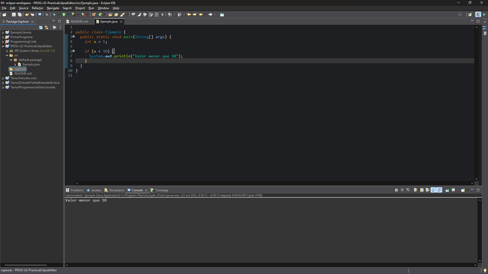
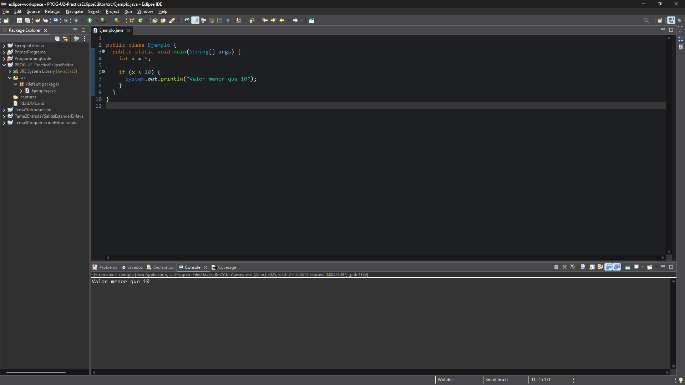
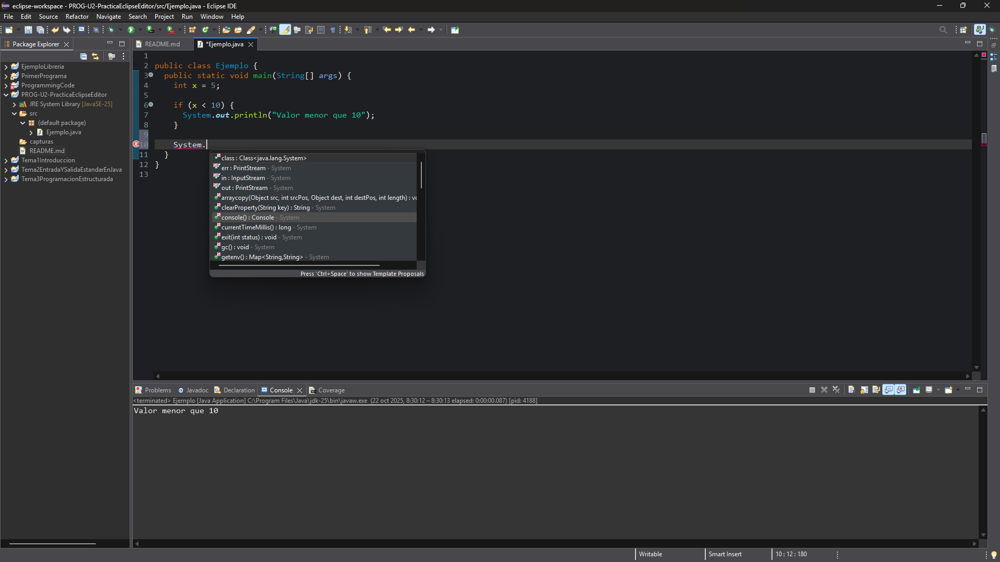
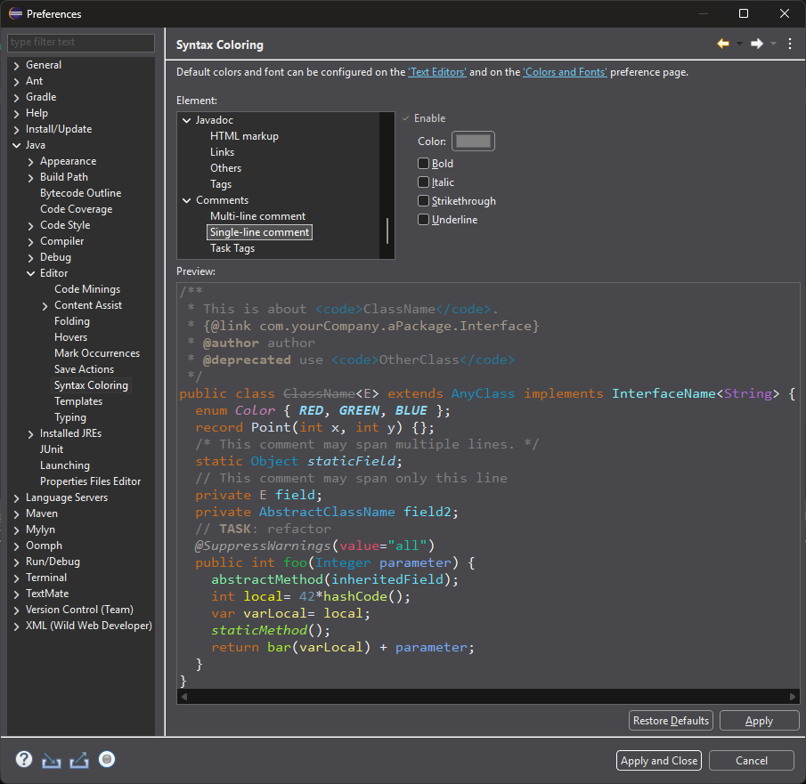
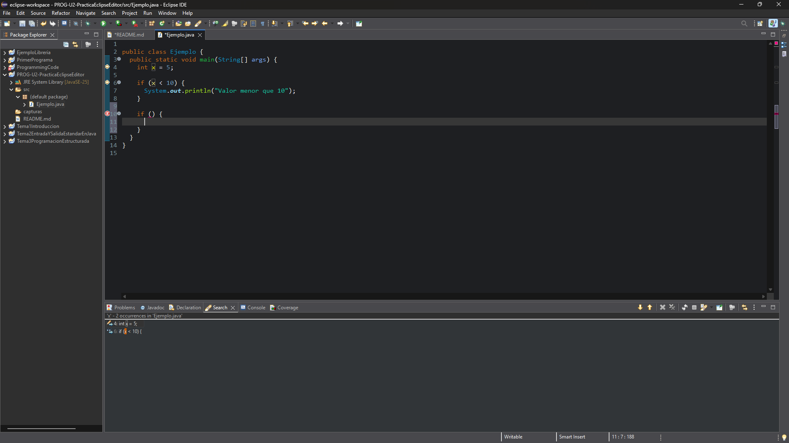
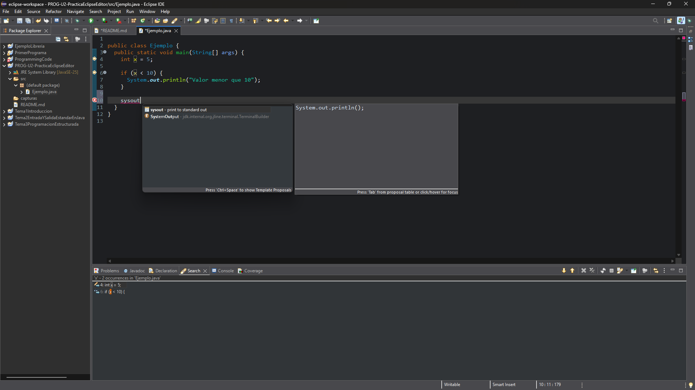

# Respuestas ejercicios

## 1. Optiones generales

Es útil ya que nos permite poder identificar todo el código que se encuentra dentro de un bloque. Aparte, podemos nagedar a la apertura o cierre del bloque.

## 2. Save Actions

- **Format source code**: Nos añade formato a nuestro código, haciendo que contenga la identación correcta y que siga un orden.
- **Organize imports**: Ordena los imports por orden alfabético.

## 3. Content Assist

Este parametro es el tiempo en milisegundos que va a tardar en mostrarnos la lista de sugerencias.

_Content Assist_ permite vernos sugerencias de códigos, como pueden ser shortcuts, métodos de la clase que estamos accediendo, etc. Mejora la productividad ya que nos permite ahorrarnos un tiempo en escribir el código.

## 4. Syntax Coloring

Es importante que exista un contraste visual ya que nos permite poder analizar de una manera más rápida las diferentes partes de nuestro código (variables, keywords, etc) y permite que nos podamos centrar en diferentes partes del código ya que no se ve monotomo.

## 5. Mark occurrences

Si está activado el resaltado automático, se puede ver en el propio código todas las ocurrencias, mientras que con _Search References_ se tiene que ver en la pestaña de `Search`.

## 6. Typing

Nos ayuda ya que no necesitamos preocuparnos por los cierres de las llaves, paréntesis, comillas, ya que está función se encargará de eso.

## 7. Templates

Las plantillas son un trozo de código, que se almacenan con un nombre, que nos permite añadir ese código mediante la ejecución de la plantilla.

Se localizan en la ruta `Window > Preferences > Java > Editor > Templates`.

